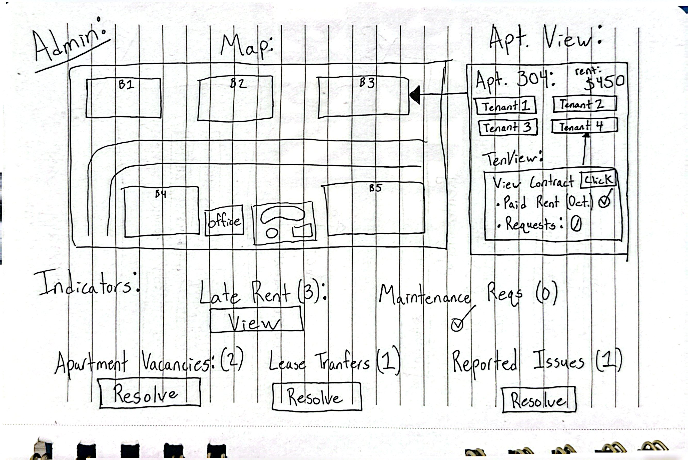
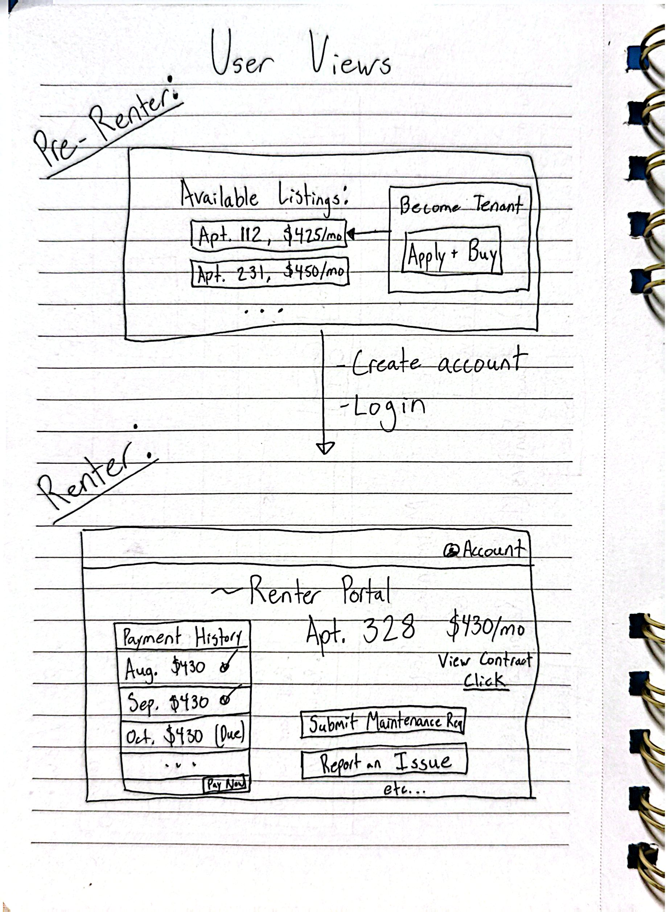
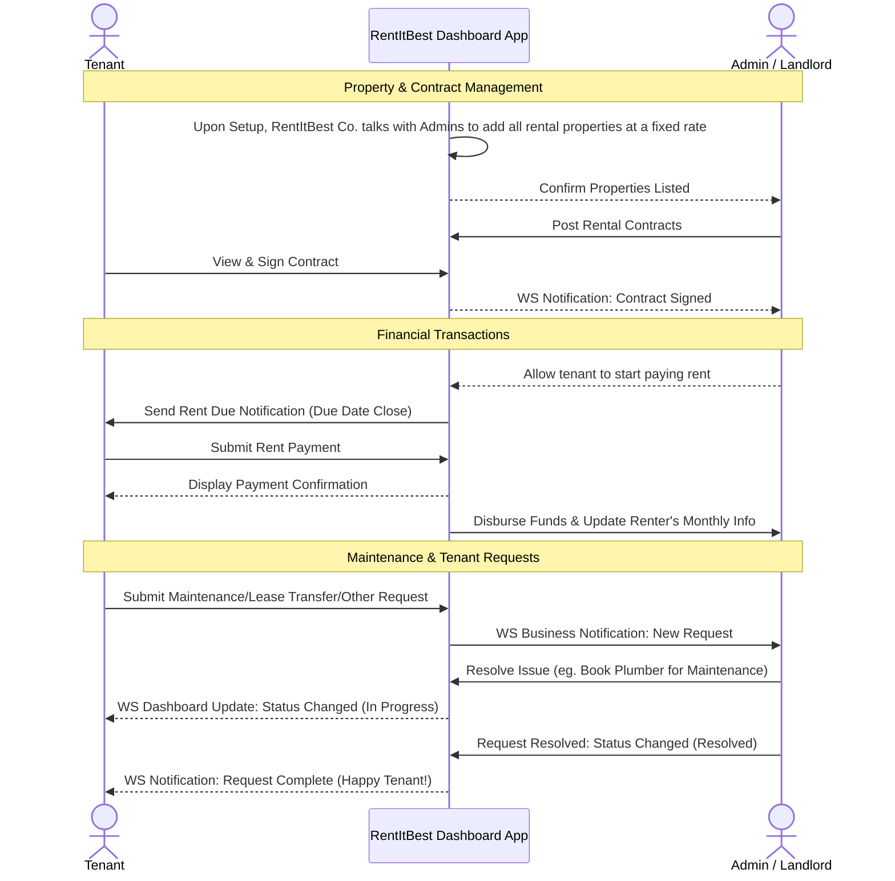

# RentItBest 
## The Best Rental Solution for Tenants and Landlords Alike

[My Notes](notes.md)

RentItBest is a rental management web-app that benefits both tenants and landlords through its dashboard design.

### Elevator pitch

Isn't it frustrating when your property management company has a poorly managed dashboard app for all its rental properties and employees struggle with managing every tenants and all their needs? Isn't it even worse to be a tenant who has difficulty using the app to pay rent, request maintenance, and, oh boy-- don't even get me started with selling a contract! The solution to both these problems is a uniform dashboard for both tenants and landlords: one app where properties, contracts, and tenant requests are managed and all the needs of a tenant are met. Clean UI combined with interactive dashboards and useful business notifications allows for a rental company to maximize the value of their properties while being a breath of fresh air for tenants who find renting from your company to be such a positive and easy experience that they fall in love renting from you!

### Design

The renting experience becomes a joy only when the rental company is organized and under control:

Above is an overview of a property of Totally Real Rentals Co., which has interactable units that open up a pop-up to view all tenants, their information, any pending requests, and the agreements of their contract. At the bottom lies a variety of indicators regarding important business obligations, such as late rent, maintenance requests, lease transfer requests, etc.

Once we have a clean, organized, and efficient app for the admins (property managers), we then turn our focus to an excellent UI for our tenants.

While simple for the purposes of this project, a potential tenant can browse the available options for property listings, and if they desire to "buy" the lease they can create an account and login, which for the purposes of the class we will consider signing a contract. They then are brought to a dashboard showing their payment history, information regarding their contract, and options to submit maintenance requests, report issues, etc.

### Sequence Diagram

Below are some examples of the tenant and landlord interactions possible through the app!

### Key features

- Admin (Landlord):
    - Provide an interactive overview of the properties, allowing for individual property/tenant inspection
    - Indicators and WS notifications regarding important business actions (rent payments, vacancies, maintenance requests, etc.)
- User (Tenant):
    - Ability to view available properties and create an account in order to "purchase and sign" a contract
    - Provide an interactive user view with tenant actions for paying rent, requesting maintenance, etc.

### Technologies

I am going to use the required technologies in the following ways.

- **HTML** - Structure for both admin and user dashboards and user login page. Contains containers for interactive elements.
- **CSS** - Application styling that sells the organizational efficiency to rental companies and attracts tenants with its seamless UI.
- **React** - Dynamic logic such as pop-ups, available property listings, or form input fields. 
- **Service** - Backend service for login, "purchasing" contracts, making payments, creating and resolving different types of requests, and updating property and tenant statuses.
- **DB/Login** - Store user/admin accounts, properties, contracts, all types of requests, and payments. Access credentials (whether to enter admin flow or tenant flow) stored and delivered upon login.
- **WebSocket** - Real-time interaction by updating indicators regarding rent and vacancies and by broadcasting business notifications to all admins regarding new requests.

## 🚀 Specification Deliverable

> [!NOTE]
> Fill in this sections as the submission artifact for this deliverable. You can refer to this [example](https://github.com/webprogramming260/startup-example/blob/main/README.md) for inspiration.

For this deliverable I did the following. I checked the box `[x]` and added a description for things I completed.

- [x] I completed the prerequisites for this deliverable (Git commit requirement)
- [x] Proper use of Markdown
- [x] A concise and compelling elevator pitch
- [x] Description of key features
- [x] Description of how you will use each technology
- [x] One or more rough sketches of your application. Images must be embedded in this file using Markdown image references.

## 🚀 AWS deliverable

For this deliverable I did the following. I checked the box `[x]` and added a description for things I completed.

- [ ] **Rented EC2 server** - I did not complete this part of the deliverable.
- [ ] **Leased domain name** - I did not complete this part of the deliverable.
- [ ] **Server accessible** from my domain: [https://yourdomainnamehere.click](https://yourdomainnamehere.click) - I did not complete this part of the deliverable.

## 🚀 HTML deliverable

For this deliverable I did the following. I checked the box `[x]` and added a description for things I completed.

- [ ] I completed the prerequisites for this deliverable (Simon deployed, GitHub link, Git commits)
- [ ] **HTML pages** - I did not complete this part of the deliverable.
- [ ] **Proper HTML element usage** - I did not complete this part of the deliverable.
- [ ] **Links** - I did not complete this part of the deliverable.
- [ ] **Text** - I did not complete this part of the deliverable.
- [ ] **3rd party API placeholder** - I did not complete this part of the deliverable.
- [ ] **Images** - I did not complete this part of the deliverable.
- [ ] **Login placeholder** - I did not complete this part of the deliverable.
- [ ] **DB data placeholder** - I did not complete this part of the deliverable.
- [ ] **WebSocket placeholder** - I did not complete this part of the deliverable.

## 🚀 CSS deliverable

For this deliverable I did the following. I checked the box `[x]` and added a description for things I completed.

- [ ] I completed the prerequisites for this deliverable (Simon deployed, GitHub link, Git commits)
- [ ] **Visually appealing colors and layout. No overflowing elements.** - I did not complete this part of the deliverable.
- [ ] **Use of a CSS framework** - I did not complete this part of the deliverable.
- [ ] **All visual elements styled using CSS** - I did not complete this part of the deliverable.
- [ ] **Responsive to window resizing using flexbox and/or grid display** - I did not complete this part of the deliverable.
- [ ] **Use of a imported font** - I did not complete this part of the deliverable.
- [ ] **Use of different types of selectors including element, class, ID, and pseudo selectors** - I did not complete this part of the deliverable.

## 🚀 React part 1: Routing deliverable

For this deliverable I did the following. I checked the box `[x]` and added a description for things I completed.

- [ ] I completed the prerequisites for this deliverable (Simon deployed, GitHub link, Git commits)
- [ ] **Bundled using Vite** - I did not complete this part of the deliverable.
- [ ] **Components** - I did not complete this part of the deliverable.
- [ ] **Router** - I did not complete this part of the deliverable.

## 🚀 React part 2: Reactivity deliverable

For this deliverable I did the following. I checked the box `[x]` and added a description for things I completed.

- [ ] I completed the prerequisites for this deliverable (Simon deployed, GitHub link, Git commits)
- [ ] **All functionality implemented or mocked out** - I did not complete this part of the deliverable.
- [ ] **Hooks** - I did not complete this part of the deliverable.

## 🚀 Service deliverable

For this deliverable I did the following. I checked the box `[x]` and added a description for things I completed.

- [ ] I completed the prerequisites for this deliverable (Simon deployed, GitHub link, Git commits)
- [ ] **Node.js/Express HTTP service** - I did not complete this part of the deliverable.
- [ ] **Static middleware for frontend** - I did not complete this part of the deliverable.
- [ ] **Calls to third party endpoints** - I did not complete this part of the deliverable.
- [ ] **Backend service endpoints** - I did not complete this part of the deliverable.
- [ ] **Frontend calls service endpoints** - I did not complete this part of the deliverable.
- [ ] **Supports registration, login, logout, and restricted endpoint** - I did not complete this part of the deliverable.
- [ ] **Uses BCrypt to hash passwords** - I did not complete this part of the deliverable.

## 🚀 DB deliverable

For this deliverable I did the following. I checked the box `[x]` and added a description for things I completed.

- [ ] I completed the prerequisites for this deliverable (Simon deployed, GitHub link, Git commits)
- [ ] **Stores data in MongoDB** - I did not complete this part of the deliverable.
- [ ] **Stores credentials in MongoDB** - I did not complete this part of the deliverable.

## 🚀 WebSocket deliverable

For this deliverable I did the following. I checked the box `[x]` and added a description for things I completed.

- [ ] I completed the prerequisites for this deliverable (Simon deployed, GitHub link, Git commits)
- [ ] **Backend listens for WebSocket connection** - I did not complete this part of the deliverable.
- [ ] **Frontend makes WebSocket connection** - I did not complete this part of the deliverable.
- [ ] **Data sent over WebSocket connection** - I did not complete this part of the deliverable.
- [ ] **WebSocket data displayed** - I did not complete this part of the deliverable.
- [ ] **Application is fully functional** - I did not complete this part of the deliverable.
